<p align="center">
  
</p>

<h1 align="center">BRS-XSS</h1>

<p align="center">
  <strong>Advanced XSS Vulnerability Scanner</strong>
</p>

<p align="center">
  Deterministic, auditable XSS detection for modern web applications
</p>

<p align="center">
  
  
  
</p>

<p align="center">
  <a href="https://brs-kb.easypro.tech">BRS-KB API</a> •
  <a href="https://github.com/EPTLLC/brs-xss">GitHub</a> •
  <a href="https://t.me/EasyProTech">Telegram</a>
</p>

> **Beta Release**: This is an active development version. We are continuously testing, refining detection algorithms, and improving the user experience. Expect regular updates with new features, performance optimizations, and bug fixes. Your feedback is valuable — report issues on [GitHub](https://github.com/EPTLLC/brs-xss/issues) or reach out via [Telegram](https://t.me/EasyProTech).

---

## Overview

BRS-XSS is a professional-grade XSS vulnerability scanner powered by [BRS-KB](https://brs-kb.easypro.tech) — a comprehensive knowledge base with thousands of context-aware payloads, 169 injection contexts, and 1,999 WAF bypass techniques.

### Key Features

| Feature | Description |
|---------|-------------|
| **Context-Aware Scanning** | HTML, JavaScript, CSS, URI, SVG, XML context detection |
| **WAF Evasion** | Cloudflare, Akamai, AWS WAF, Imperva, ModSecurity, Sucuri |
| **DOM Analysis** | Browser-based DOM XSS detection via Playwright |
| **Smart Classification** | XSS type detection with confidence scoring |
| **PTT Strategy Engine** | Pentesting Task Tree for adaptive scanning |
| **A/B Testing** | Compare strategy effectiveness |
| **Multi-Format Reports** | PDF, HTML, JSON, SARIF, JUnit |
| **Telegram Integration** | Real-time notifications with PDF reports |

---

## Web UI

BRS-XSS includes a modern, dark-themed web interface for easy scanning and result analysis.

### Login

<p align="center">
  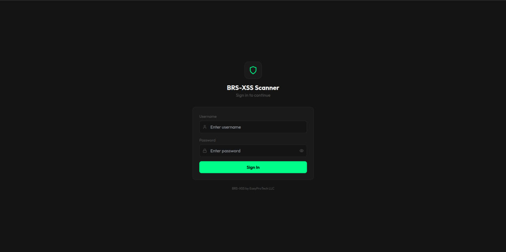
</p>

Secure authentication with session management.

### Dashboard

<p align="center">
  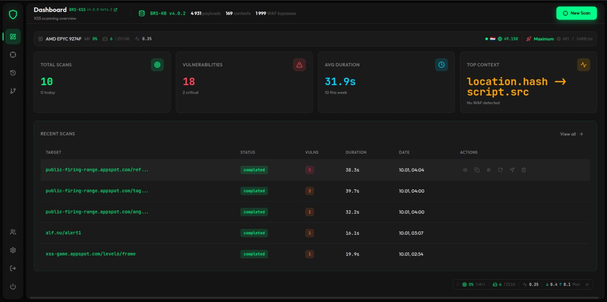
</p>

Real-time overview featuring:
- **Statistics Cards**: Total scans, vulnerabilities found, average duration, top context
- **System Profile**: Hardware detection with performance mode recommendation
- **BRS-KB Status**: Live payload/context/WAF bypass counts
- **Recent Scans**: Quick access with inline actions (view, PDF, JSON, Telegram, rescan, delete)

### New Scan

<p align="center">
  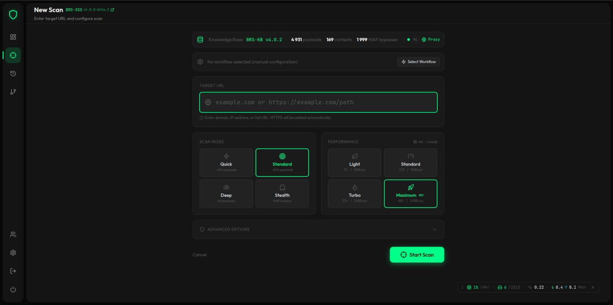
</p>

<p align="center">
  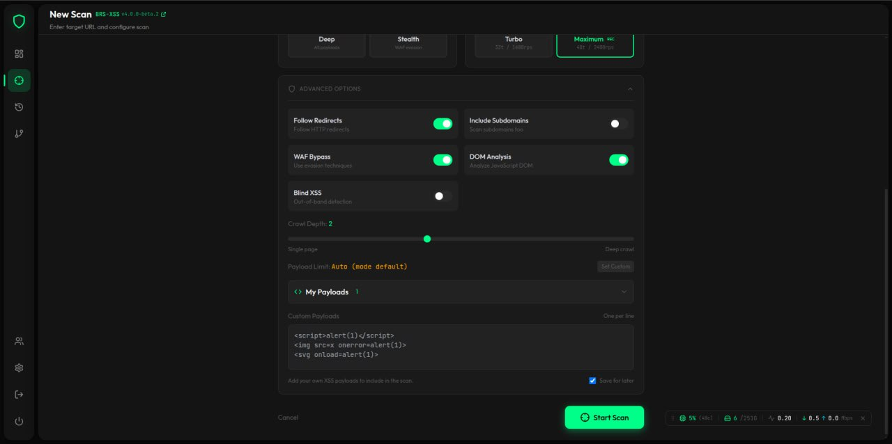
</p>

Flexible scan configuration:
- **Target URL**: Smart parsing (auto-HTTPS, domain/IP/full URL support)
- **Scan Mode**: Quick (~100), Standard (~500), Deep (all), Stealth (WAF evasion)
- **Performance**: Light / Standard / Turbo / Maximum (hardware-based)
- **Advanced Options**: Crawl depth, custom payloads, Blind XSS, DOM analysis

### Scan History

<p align="center">
  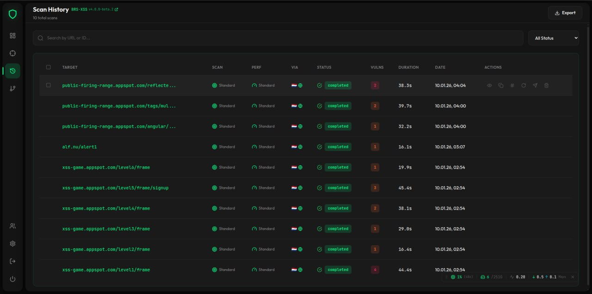
</p>

Complete scan archive with:
- Search by URL or scan ID
- Status filtering (All/Completed/Running/Failed)
- Detailed table: Target, Mode, Performance, Proxy, Status, Vulns, Duration
- Bulk export to JSON

### Scan Details

<p align="center">
  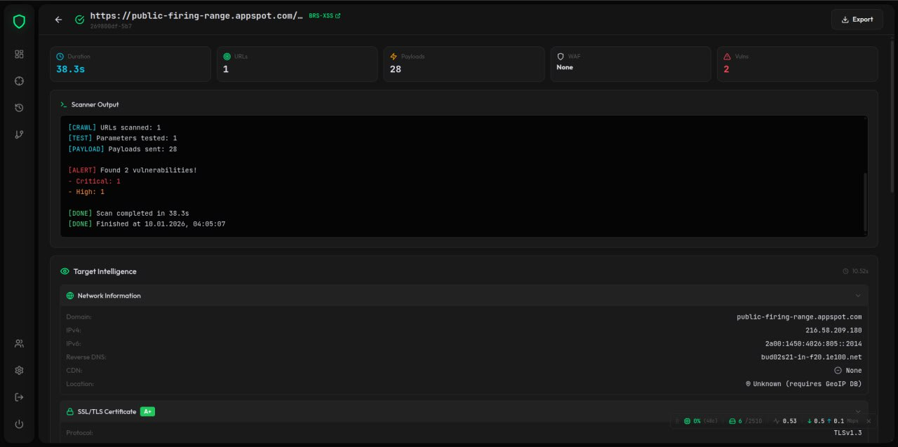
</p>

<p align="center">
  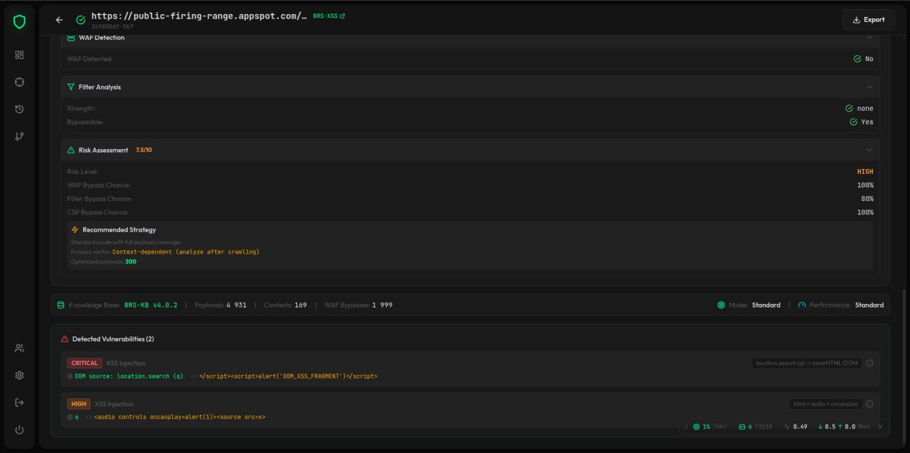
</p>

Comprehensive results including:
- **Scanner Output**: Real-time log with color-coded markers
- **Target Intelligence**: Network info, SSL grade, tech stack, security headers, WAF detection
- **Risk Assessment**: 0-10 score with bypass chances
- **Detected Vulnerabilities**: Severity, XSS type, DOM source, payload class, full payload

### Rescan

<p align="center">
  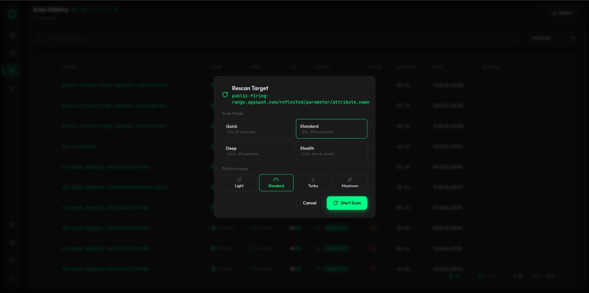
</p>

Quick rescan with pre-filled configuration from previous scan.

### Strategy (PTT)

<p align="center">
  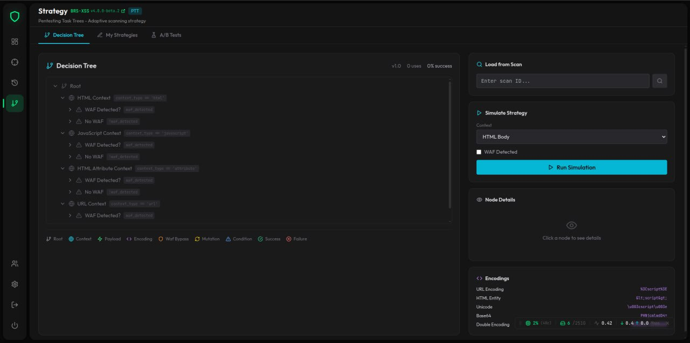
</p>

<p align="center">
  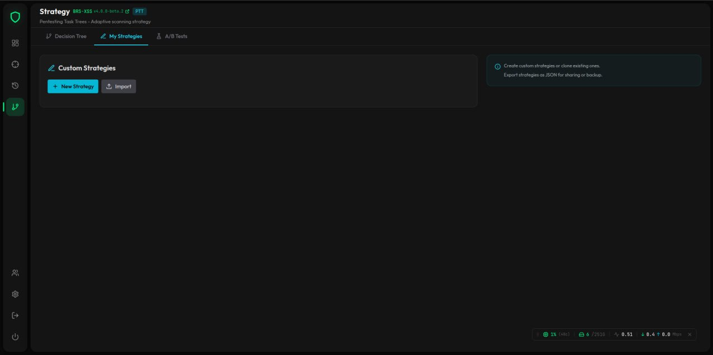
</p>

<p align="center">
  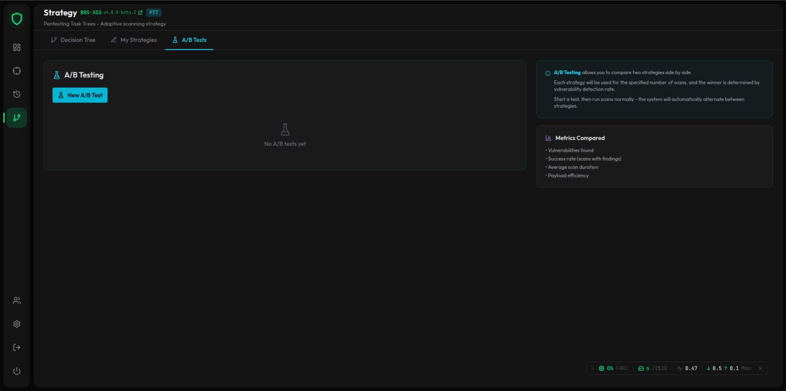
</p>

Pentesting Task Tree management:
- **Decision Tree**: Visual strategy flow with context/WAF/payload nodes
- **My Strategies**: Create, clone, edit, delete custom strategies
- **A/B Testing**: Compare two strategies with metrics tracking
- **Simulation**: Test strategy execution without scanning

### Settings

<p align="center">
  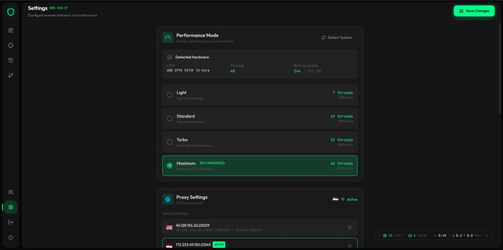
</p>

<p align="center">
  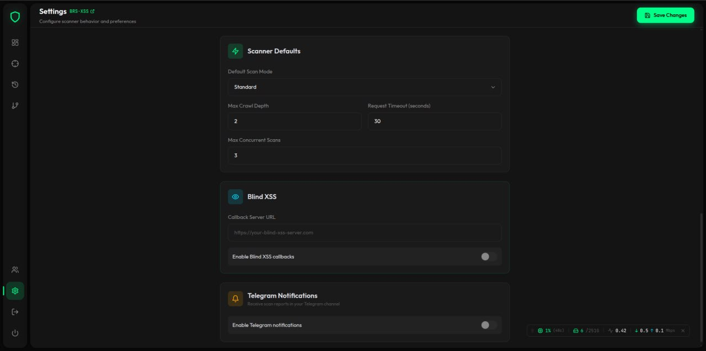
</p>

Full configuration:
- **Performance Mode**: Auto-detect hardware, select optimal mode
- **Proxy Settings**: Multi-proxy support (SOCKS5/4/HTTP/HTTPS), test & activate
- **Scan Defaults**: Default mode, crawl depth, timeout, concurrent scans
- **Blind XSS**: Callback server configuration
- **Telegram**: Bot token, channel ID, notification level

### User Management

<p align="center">
  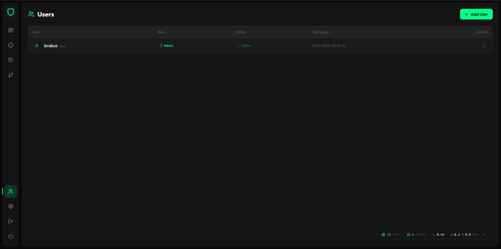
</p>

Multi-user support with role-based access.

---

## Quick Start

### Installation

```bash
# PyPI
pip install brs-xss
playwright install chromium

# GitHub
git clone https://github.com/EPTLLC/brs-xss.git
cd brs-xss
pip install -e .
playwright install chromium
```

### System Dependencies

**macOS**:
```bash
brew install pango libffi
```

**Ubuntu/Debian**:
```bash
sudo apt-get install libpango-1.0-0 libpangocairo-1.0-0 libgdk-pixbuf2.0-0 libffi-dev shared-mime-info
```

### Start Web UI

```bash
python3 scripts/run_web_ui.py
```

Access at `http://localhost:5173`

### CLI Usage

```bash
# Quick scan
brs-xss scan https://target.com

# Deep scan with report
brs-xss scan https://target.com --deep --output report.json

# Verbose with custom threads
brs-xss scan https://target.com --verbose --threads 20

# Check KB status
brs-xss kb info
```

---

## Classification Engine

Accurate vulnerability classification with dynamic analysis:

| Feature | Description |
|---------|-------------|
| **XSS Type Classifier** | Reflected, DOM-based, Stored, Mutation |
| **Context Parser** | Hierarchical: `html > img > onerror` |
| **Payload Classifier** | Consistent PAYLOAD CLASS for every finding |
| **Confidence Calculator** | Factor-based scoring with DOM/trigger boosts |

**Example Output:**
```json
{
  "vulnerability_type": "DOM XSS (Event Handler)",
  "payload_class": "HTML Attribute Injection | Trigger: img.onerror",
  "confidence": 0.92,
  "severity": "high"
}
```

---

## Configuration

### Environment Variables

| Variable | Description |
|----------|-------------|
| `BRSXSS_KB_API_KEY` | BRS-KB API key |
| `BRSXSS_KB_API_URL` | Override KB endpoint |
| `BRSXSS_KB_MODE` | `remote`, `local`, or `auto` |
| `BRS_XSS_SAFE_MODE` | Toggle safe mode |
| `BRS_XSS_MAX_PAYLOADS` | Max payloads per parameter |

### Local Mode (Offline)

```bash
pip install git+https://github.com/EPTLLC/BRS-KB.git
export BRSXSS_KB_MODE="local"
export BRSXSS_KB_LOCAL_PATH="/opt/brs-kb"
```

---

## Telegram Integration

Real-time notifications with PDF reports:

1. Create bot via [@BotFather](https://t.me/BotFather)
2. Get channel ID via [@userinfobot](https://t.me/userinfobot)
3. Configure in **Settings → Telegram**

Or via environment:
```bash
export BRSXSS_TELEGRAM_BOT_TOKEN="your-bot-token"
export BRSXSS_TELEGRAM_CHANNEL_ID="-100123456789"
```

---

## Links

- **GitHub**: https://github.com/EPTLLC/brs-xss
- **BRS-KB API**: https://brs-kb.easypro.tech
- **Documentation**: https://brs-kb.easypro.tech/docs.html
- **Telegram**: https://t.me/EasyProTech

---

## Legal

This tool is for **authorized security testing only**.

By using BRS-XSS you agree:
- You have explicit permission to test target systems
- You will not use this tool for illegal purposes
- Authors are not responsible for misuse

---

## License

MIT License • Copyright (c) 2023-2026 EasyProTech LLC

https://www.easypro.tech
