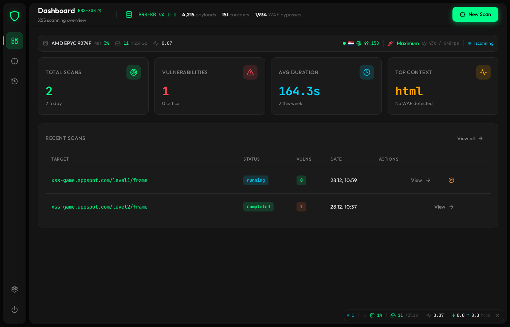
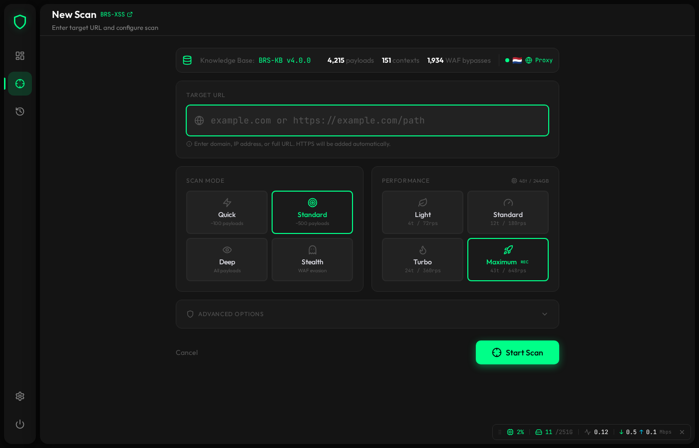
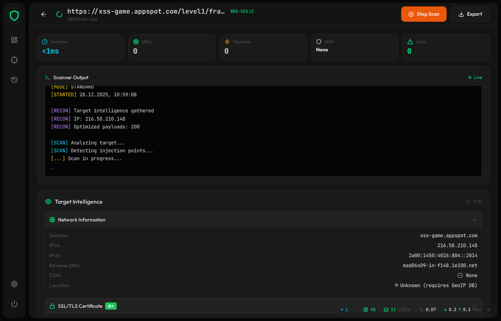

# BRS-XSS

**Advanced XSS Vulnerability Scanner**

Deterministic, auditable XSS detection for modern web applications.


> Context-aware XSS scanner powered by [BRS-KB](https://brs-kb.easypro.tech)

> ⚠️ **Beta Release**: v4.0.0-beta.1 includes new parallel scanning and Web UI. Some features are still being stabilized.

---

## Features

- **Context-Aware Payloads**: HTML, JavaScript, CSS, URI, SVG, XML contexts
- **WAF Evasion**: Cloudflare, Akamai, AWS WAF, Imperva, ModSecurity, Sucuri
- **DOM Analysis**: Full browser-based DOM XSS detection via Playwright
- **Smart Scoring**: Context-aware payload effectiveness scoring
- **Multi-Format Reports**: PDF / HTML / JSON / SARIF / CI-friendly JUnit with identical content and confirmed vs potential sections
- **Classification Engine**: Intelligent XSS type classification and confidence scoring

---

## Classification Engine (v4.0.0)

Accurate vulnerability classification with dynamic analysis:

| Feature | Description |
|---------|-------------|
| **XSS Type Classifier** | Reflected, DOM-based, Stored, Mutation detection |
| **Context Parser** | Hierarchical context: `html > img > onerror` |
| **Payload Classifier** | Consistent PAYLOAD CLASS for every finding |
| **Confidence Calculator** | Factor-based scoring with DOM/trigger boosts |

**Example Output:**
```json
{
  "vulnerability_type": "DOM XSS (Event Handler)",
  "payload_class": "HTML Attribute Injection | Trigger: img.onerror",
  "confidence": 0.92,
  "severity": "high",
  "is_deterministic": true
}
```

See [docs/classification-engine.md](docs/classification-engine.md) for details.

---

## Powered by BRS-KB

BRS-XSS uses [BRS-KB](https://brs-kb.easypro.tech) - XSS Knowledge Base API:

- Thousands of context-aware payloads
- 150+ injection contexts
- Extensive WAF bypass techniques

Real-time statistics available at [brs-kb.easypro.tech/api/v1/stats](https://brs-kb.easypro.tech/api/v1/stats)

API is free, no rate limits, instant access.

---

## Installation

### PyPI
```bash
pip install brs-xss
playwright install chromium
```

### GitHub
```bash
git clone https://github.com/EPTLLC/BRS-XSS.git
cd BRS-XSS
pip install -e .
playwright install chromium
```

---

## Web UI

BRS-XSS includes a modern web interface for easy scanning and result analysis.

### Dashboard



*Real-time statistics, recent scans, and quick access to all features.*

### New Scan



*Configure scan target, mode, and parameters with live BRS-KB statistics.*

### Scan Details



*Detailed vulnerability findings with PAYLOAD CLASS, confidence scores, and exploitation info.*

### Start Web UI

Use the unified launcher to spin up FastAPI + Vite with one command:

```bash
python3 scripts/run_web_ui.py
```

What the launcher does:
- verifies Python deps (`uvicorn`, `fastapi`);
- installs frontend deps strictly via `bun install` if `node_modules/` is missing;
- frees both ports (backend 8000, frontend 5173) before starting;
- runs uvicorn and `bunx --bun vite` in parallel, prefixing logs with `[backend]` / `[frontend]`;
- shuts down both processes cleanly on Ctrl+C.

Useful flags:

```bash
# Custom hosts/ports
python3 scripts/run_web_ui.py --backend-host 127.0.0.1 --backend-port 8210 --frontend-port 5185

# Skip automatic frontend install (pre-provisioned node_modules)
python3 scripts/run_web_ui.py --skip-install

# Disable uvicorn autoreload (production-like behavior)
python3 scripts/run_web_ui.py --no-backend-reload
```

Access:
- Backend API/WebSocket: `http://<backend-host>:<backend-port>` (default `0.0.0.0:8000`).
- React frontend: the URL printed by the launcher (default `http://localhost:5173`).

> The frontend toolchain is Bun-only (Bun ≥1.3 for `bun install` / `bunx --bun vite`). npm/pnpm/yarn are intentionally not supported.

---

## CLI Usage

### Quick Scan
```bash
brs-xss scan https://target.com
```

### Deep Scan with Report
```bash
brs-xss scan https://target.com --deep --output report.json
```

### Verbose Scan
```bash
brs-xss scan https://target.com --verbose --threads 20
```

### Safe Mode (default)
```bash
brs-xss scan https://target.com --safe-mode --max-payloads 200
```

### Check KB Status
```bash
brs-xss kb info
brs-xss kb list
```

### Available CLI Options
```bash
brs-xss scan --help
```

| Option | Description |
|--------|-------------|
| `--threads` | Max concurrent requests (default: 10) |
| `--timeout` | Request timeout in seconds (default: 15) |
| `--output` | Path to save JSON report |
| `--deep` | Enable deep discovery (crawl forms) |
| `--verbose` | Verbose output |
| `--safe-mode` | Restrict dangerous payloads (default: true) |
| `--pool-cap` | Max payload pool size (default: 10000) |
| `--max-payloads` | Max payloads per entry point (default: 500) |

---

## Configuration

### BRS-KB API

Remote BRS-KB (`https://brs-kb.easypro.tech/api/v1`) is used by default. Provide an API key for production use:

```bash
export BRSXSS_KB_API_KEY="your-api-key"
```

### Configuration layers

1. **Repository defaults** — `config/default.yaml` is always loaded.
2. **Optional user config** — you can point the loader to any TOML file via `BRS_XSS_USER_CONFIG_PATH`. Example:
   ```bash
   mkdir -p ~/.config/brs-xss
   cp config/user-config-example.toml ~/.config/brs-xss/custom.toml
   export BRS_XSS_USER_CONFIG_PATH="$HOME/.config/brs-xss/custom.toml"
   ```
3. **Environment overrides** — `BRSXSS_*` (KB) and `BRS_XSS_*` (scanner/payloads) take precedence over both files.

Example YAML snippet (from `config/default.yaml`):

```yaml
kb:
  mode: "remote"
  api:
    url: "https://brs-kb.easypro.tech/api/v1"
    timeout: 30
    max_retries: 3
scanner:
  timeout: 15
  safe_mode: true
```

Example TOML snippet (drop-in user config):

```toml
[scanner]
max_concurrent = 32
rate_limit = 45.0

[payloads]
include_blind_xss = false
```

### Environment variables

| Variable | Description |
|----------|-------------|
| `BRSXSS_KB_API_KEY` | BRS-KB API key |
| `BRSXSS_KB_API_URL` | Override KB endpoint |
| `BRSXSS_KB_MODE` | `remote`, `local`, or `auto` |
| `BRSXSS_KB_LOCAL_PATH` | Path to local BRS-KB checkout |
| `BRS_XSS_SAFE_MODE` | Toggle safe mode (`true`/`false`) |
| `BRS_XSS_MAX_PAYLOADS` | Maximum payloads per parameter |
| `BRS_XSS_CONFIG_PATH` | Override default YAML config |
| `BRS_XSS_USER_CONFIG_PATH` | Path to the user TOML file |

### Local Mode (offline)

```bash
pip install git+https://github.com/EPTLLC/BRS-KB.git
export BRSXSS_KB_MODE="local"
export BRSXSS_KB_LOCAL_PATH="/opt/brs-kb"
```

---

## Links

- **Website**: https://brs-xss.easypro.tech
- **GitHub**: https://github.com/EPTLLC/BRS-XSS
- **BRS-KB API**: https://brs-kb.easypro.tech
- **Documentation**: https://brs-kb.easypro.tech/docs.html
- **Telegram**: https://t.me/EasyProTech

---

## Legal

This tool is for **authorized security testing only**.

By using BRS-XSS you agree:
- You have explicit permission to test target systems
- You will not use this tool for illegal purposes
- Authors are not responsible for misuse

---

## License

MIT License

Copyright (c) 2023-2026 EasyProTech LLC

https://www.easypro.tech
